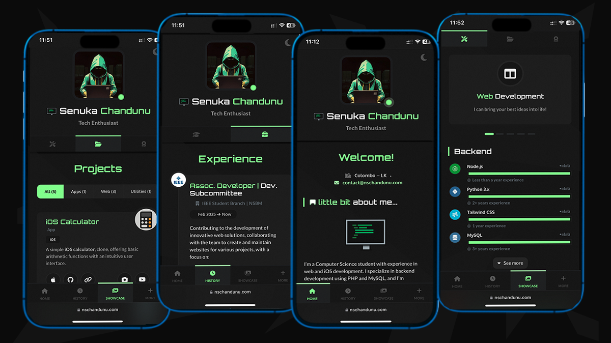

# [ Personal](https://nschandunu.com/) Portfolio

A futuristic personal portfolio website – built with **React**


Key features:
- Lightweight and fully responsive design.
- Perfectly adapts to mobile screens.
- Offers both dark and light theme options.
- Includes a variety of components to highlight work experience, education, skills, portfolio, and more.
- Built with **Vite** for efficient packaging.
- Email functionality powered by **EmailJS**.

## [Live Preview](https://nschandunu.com/)

### 1. Desktop Layout
Enjoy a seamless page-flipping transition effect when navigating via the sidebar. The toggleable sidebar enhances flexibility, expanding the content area for a wider, immersive viewing experience.


### 2. Mobile Layout
On mobile devices, the layout intelligently reorganizes portfolio sections into categorized tabs, complemented by an intuitive bottom navigation for effortless browsing.



## Folder Structure

```bash
.
├── .vscode/                          # VS Code settings
├── dist/                             # Distribution/build output
│   ├── assets/
│   ├── data/
│   │   ├── sections/                 # Section-specific data
│   │   ├── settings.json             # App settings configuration
│   │   ├── strings.json              # Localized text strings
│   │   └── structure.json            # App structure data
│   ├── images/
│   │   ├── css/                      # CSS
│   │   ├── flags/                    # Flag icons
│   │   ├── pictures/                 # General pictures
│   │   └── svg/                      # SVG assets
│   ├── index.html                    # Main HTML file (built)
├── public/
│   ├── data/
│   │   ├── sections/                 # Section-specific data
│   │   ├── settings.json             # App settings configuration
│   │   ├── strings.json              # Localized text strings
│   │   └── structure.json            # App structure data
│   └── images/
│   │   ├── css/                      # CSS
│   │   ├── flags/                    # Flag icons
│   │   ├── pictures/                 # General pictures
│   │   └── svg/                      # SVG assets
├── src/
│   ├── components/                   # Reusable UI components
│   │   ├── articles/                 # Article-related components
│   │   ├── capabilities/             # Capability-related components
│   │   ├── forms/                    # Form components
│   │   ├── generic/                  # Generic reusable components
│   │   ├── layout/                   # Layout components
│   │   ├── modals/                   # Modal components
│   │   ├── nav/                      # Navigation components
│   │   ├── widgets/                  # Widget components
│   │   ├── wrappers/                 # Wrapper components
│   │   ├── App.jsx                   # Main app component
│   │   ├── Portfolio.jsx             # Portfolio component
│   │   ├── Portfolio.scss            # Portfolio-specific styles
│   │   ├── Preloader.jsx             # Preloader component
│   │   └── Preloader.scss            # Preloader-specific styles
│   ├── helpers/
│   │   ├── emails.js                 # Email-related utilities
│   │   ├── parser.js                 # Data parsing utilities
│   │   ├── scheduler.js              # Scheduling utilities
│   │   └── utils.js                  # General utilities
│   ├── providers/
│   │   ├── DataProvider.jsx          # Data context provider
│   │   ├── FeedbacksProvider.jsx     # Feedback context provider
│   │   ├── GlobalStateProvider.jsx   # Global state provider
│   │   ├── LanguageProvider.jsx      # Language context provider
│   │   ├── ThemeProvider.jsx         # Theme context provider
│   │   └── WindowProvider.jsx        # Window context provider
│   ├── styles/                       # Global styles
│   └── main.jsx                      # Entry point for React app
├── .DS_Store                         # macOS system file
├── Icon                              # Icon file (likely unused)
├── README.md                         # Project documentation
├── LICENSE                           # License information
├── index.html                        # Main HTML template (source)
├── package-lock.json                 # Dependency lock file
├── package.json                      # Project metadata and dependencies
└── vite.config.js                    # Vite configuration
```

## Additional Frameworks & Plugins

Additional frameworks and plugins used include:
- **Font Awesome**: Free vector icons for UI enhancement.
- **Smooth Scrollbar**: Customizable scrollbar plugin.
- **Swiper**: Touch-enabled slider library.
- **EmailJS**: Client-side email service.